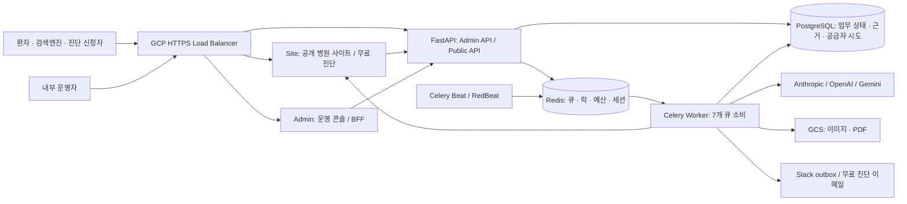
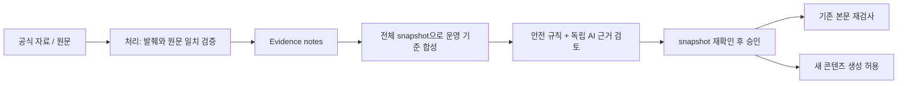

# Re:putation 현재 시스템 구조

문서 버전: **2.4** · 조사·갱신일: **2026-09-08 (Asia/Seoul)**
소스 기준선: **`31129d9911910b82c1161829d922a9760fac13a1`**
구현 상태: **기준선 위 V0 공개 게이트 분리·자동 이어가기 구현 및 검증 중. 운영 배포 전**

범위: Backend, Admin, Site, Celery, 데이터 모델, 비용·복구·알림, 배포 구성. 현재 작업 트리의 실제 호출 경로를 근거로 갱신했으며, 완료 증거는 [감사 후속 구현 기록](../reviews/2026-09-07-purpose-autonomy-efficiency-implementation.md)에 모은다. 외부 AI 답변의 임상적 정확성이나 검색 노출 효과를 새로 실험한 문서는 아니다.

## 1. 시스템의 본질

Re:putation은 병원의 공식 자료를 근거가 있는 공개 콘텐츠로 바꾸고, AI 답변에서 병원이 언급되는지 측정하여 다음 콘텐츠와 월간 보고에 연결하는 관리형 서비스다. 운영사 내부의 Admin, 환자·검색엔진을 위한 Site, 상태를 저장하는 API, 반복 실행하는 Worker/Beat로 구성된다.

운영 목표는 **최소 개입·자동 복구·필요한 알림만 전달**이다. 정상 생성·발행마다 사람의 승인을 받지 않는다. 계약 인수, 공식 정보·공개 주소의 결정, 자동 검토가 해결하지 못한 근거 충돌, 고객에게 보고서를 전달하는 행위는 사람의 책임으로 남아 있다. 현재 자동화 범위와 아직 남은 수동 경로는 아래에서 구분한다.

운영 서비스는 `reputation-api`, `reputation-worker`, `reputation-beat`, `reputation-site`, `reputation-admin` **모두 Cloud Run**이다. DB는 Cloud SQL PostgreSQL, Redis는 Memorystore 구성이다. Vercel 지원 코드·옛 배포 문서는 남아 있으나 현재 운영 프론트엔드는 Cloud Run이다. 최근 전체 운영 전환 증거는 [2026-09-07~08 배포 기록](../releases/2026-09-07-eb55518-partial.md)을 본다.

## 2. 코드의 책임 경계

| 위치 | 현재 책임 | 먼저 볼 코드 |
|---|---|---|
| `backend/app/api/admin` | 프로파일·인수·자료·일정·콘텐츠·리포트·운영 작업 API | [라우터 등록](../../backend/app/main.py), [병원](../../backend/app/api/admin/hospitals.py), [콘텐츠](../../backend/app/api/admin/content.py) |
| `backend/app/api/public` | 공개 자격을 통과한 병원·글·자산, 무료 진단 접수·조회 | [공개 사이트](../../backend/app/api/public/site.py), [자산](../../backend/app/api/public/assets.py) |
| `backend/app/services` | 근거·안전·월간 집계·발행·비용·알림 등 도메인 규칙 | 각 절의 근거 링크 |
| `backend/app/workers` | 배치 선택, 작업 claim, 재시도, 결과 저장·복구 | [tasks](../../backend/app/workers/tasks.py), [자율 복구](../../backend/app/workers/autonomous_recovery.py) |
| `admin` | 내부 운영자용 Next App Router + 같은 출처 BFF | [API 프록시](../../admin/lib/admin-api-proxy-route.ts), [운영센터](../../admin/app/operations/useOperationsCenter.ts) |
| `site` | 공통 병원 화면, 호스트 라우팅, ISR, 구조화 데이터 | [호스트 프록시](../../site/proxy.ts), [공개 API 클라이언트](../../site/lib/api.ts) |
| `terraform`, `scripts` | 인프라 선언·배포·연결 예산·준비 상태 검사 | [Cloud Run](../../terraform/cloudrun.tf), [배포](../../scripts/deploy.sh) |

Backend는 Python 3.11, FastAPI, SQLAlchemy, Alembic, Celery, Jinja2/WeasyPrint를 사용한다. API는 async 세션, Celery에는 sync 세션과 별도 async 호출이 공존한다. Worker/Beat의 async 세션은 이벤트 루프 간 연결 재사용을 피하려고 NullPool을 쓴다. 모든 DB 접근이 async라는 옛 규칙은 구현 사실과 다르다. [DB 세션](../../backend/app/core/database.py)

조사 기준 잠금 파일의 Next 버전은 Admin/Site 모두 16.3.1이다. Admin은 React 19 계열, Site는 React 18 계열이며 각각 standalone 서버를 빌드한다. 패키지의 `0.1.0`은 배포 식별자가 아니다. 운영 릴리스는 Git SHA, 이미지 digest, Cloud Run revision을 함께 기록한다. [Admin 패키지](../../admin/package.json), [Site 패키지](../../site/package.json)

## 3. 데이터 소유권과 기록의 의미

| 모델 묶음 | 소유하는 사실 | 혼동하면 안 되는 점 |
|---|---|---|
| Hospital / HospitalHandoff | 병원 프로파일, 인수, 공개 주소·상태·요금제 | `site_live` 하나로 공개 가능 여부를 판단하지 않는다 |
| SourceAsset / SourceEvidenceNote / ContentPhilosophy | 원문, 검증된 발췌, 운영 기준과 자료 snapshot | 저장된 APPROVED와 현재 자료에 대한 유효 승인은 다를 수 있다 |
| OperationRun (`SOURCE_EVIDENCE_PROCESSING`) | 전체 처리 대상 snapshot, cursor, lease, 현재 claim과 자동 복구 상태 | API 응답 성공과 전체 자료 처리 종결은 별개다 |
| ContentSchedule / ContentItem | 계약 편수, 슬롯·예정일, 본문·참고자료·이미지·발행·검수, revision·claim·provenance·이미지 인증 | 빈 슬롯도 DRAFT다. PUBLISHED여도 공개 안전 필터에서 숨겨질 수 있다 |
| QueryMatrix / Target / Variant / SovRecord / MeasurementRun | 질문 설계, 플랫폼별 응답·판정, 측정 실행 | 오류를 미언급 0점으로 바꾸면 안 된다 |
| ExposureGap / ExposureAction | 노출 부족과 보완 행동, 콘텐츠 연결 | 연결된 콘텐츠가 언급 증가의 인과적 원인이라는 뜻은 아니다 |
| MonthlyManifest / Cell / Attempt / MeasurementObservationSlot | 월별 고정 분모, 질문·플랫폼·반복 슬롯, 답변과 판정 체크포인트 | COMPLETE/LIMITED/UNAVAILABLE와 레거시 근거를 구분한다 |
| MonthlyReport / Artifact / DeliveryEvent | 집계, 독자별 PDF 검증, 전달·정정·철회 이력 | 파일 생성, 검증 완료, 실제 전달은 별개다 |
| HospitalServiceInterval | 활성 서비스 구간 | 현재 ACTIVE만으로 과거 월 계약 의무를 재구성하지 않는다 |
| OperationRun / Incident / NotificationOutbox | 작업·재시도·문제 에피소드·알림 전송 | Slack 성공이 업무 성공을 대신하지 않는다 |
| SalesLead / LeadDiagnosis / LeadReportArtifact / LeadDelivery | 무료 진단·CRM 및 신청자 이메일 전달 | 유료 월간 보고서의 전달 흐름과 별도다 |
| ProviderUsageEvent / HospitalUsageEvent / AdminAuditLog | 공급자 HTTP 시도·귀속·cache·token/search/image 단위, 병원 사용량, 관리 변경 이력 | 비용 예약 영수증과 공급자 시도 원장은 서로 다른 사실이다 |

모델 정본: [모델 목록](../../backend/app/models/__init__.py), [콘텐츠](../../backend/app/models/content.py), [월간 제어](../../backend/app/models/monthly_control.py), [운영 제어](../../backend/app/models/operations.py).

## 4. 온보딩과 공개 게이트

1. 계약 인수와 운영 담당자를 기록한다. 최초 `profile_complete=True` 전환에는 승인된 인수와 필수 프로파일 항목이 필요하다. 현재 필수 항목에는 공식 병원 식별 정보·좌표·진료 항목 등이 포함되므로 옛 입력 목록을 복사해서 검증하지 않는다.
2. 프로파일 완료를 저장하면 V0 초기 진단과 사이트 준비를 서로 독립적으로 등록한다. V0는 측정·PDF를 저장하고 `v0_report_done`을 올리는 백그라운드 산출물이며, 진행 중이거나 늦게 끝난다는 이유로 사이트 준비와 공개 시작을 막지 않는다.
3. `build_aeo_site`는 이름과 달리 병원별 HTML/CSS 파일 생성기가 아니다. 프로파일이 완료된 병원의 `site_built` 상태를 준비하고 공통 Site에서 제공할 병원을 활성화한다.
4. 공개 활성화 공통 선행조건은 **`profile_complete && site_built`**다. 일정·Essence 승인·V0 완료를 여기에 추가하지 않는다. 기본 플랫폼 주소는 조건 충족 시 자동 활성화하며, 자기 도메인은 별도 연결·DNS/TLS 검증 경로를 따른다. 자동 작업은 PAUSED 병원을 임의로 재개하지 않는다. 늦게 끝난 V0도 이미 결정된 ACTIVE·PAUSED·PENDING_DOMAIN 상태를 되돌리지 않는다.
5. 콘텐츠 운영 준비는 별도다. 일정 설정과 최신 전체 자료 기반의 유효한 Essence가 필요하다. 병원 기본 화면 공개와 콘텐츠 신규 생성 준비를 같은 단계로 묶지 않는다.

`HospitalStatus`는 ONBOARDING, ANALYZING, BUILDING, PENDING_DOMAIN, ACTIVE, PAUSED를 가지지만 모든 변경이 하나의 엄격한 상태 전이 그래프에 모인 것은 아니다. 일시중지는 서비스 구간을 닫고 공개 API는 ACTIVE를 요구한다. `site_live`는 중지 시에도 남을 수 있다. 재개 경로의 도메인 검사는 신규 연결의 모든 DNS/TLS 검사와 동일하다고 단정하지 않는다.

근거: [필수 항목·활성화 조건](../../backend/app/services/hospital_lifecycle.py), [활성화 전환](../../backend/app/services/hospital_activation.py), [프로파일·중지·재개](../../backend/app/api/admin/hospitals.py), [V0·사이트 준비 작업](../../backend/app/workers/tasks.py).

## 5. 공식 자료와 Essence 자동 운영

텍스트 자료 상태는 PENDING/PROCESSED/ERROR/EXCLUDED, 운영 기준은 DRAFT/APPROVED/ARCHIVED다. 사진 및 EXCLUDED 자료는 필수 텍스트 처리 집합에서 제외한다. snapshot은 자료 ID·내용 hash·처리 상태·처리 시각 등을 사용한다. 새 자료가 들어오면 DB의 APPROVED enum을 즉시 바꾸지 않아도 현재 readiness가 stale을 계산한다.

- **`current`**: 모든 필수 자료가 처리됐고 승인 snapshot이 최신 전체 자료와 일치해야 한다. 신규 생성·발행에 쓰는 엄격한 게이트다.
- **`public_philosophy`**: 기존 승인에 쓰인 자료가 온전하면 추가 자료 처리 중에도 기존 공개 기준을 유지할 수 있다. 기존 근거 자체가 수정·제외·미처리되면 허용하지 않는다. 신규 생성 권한으로 대체해서는 안 된다.

일반 텍스트 자료가 생성되거나 실질적으로 바뀌면 `SOURCE_EVIDENCE_PROCESSING` 실행이 전체 대상 ID와 입력 hash를 snapshot으로 저장하고 cursor를 전진시킨다. 한 병원에는 한 실행만 진행하며, 한 번에 일부만 처리해도 다음 dispatch가 남은 자료를 잇는다. 같은 정규화 값의 PATCH는 처리 상태와 근거를 바꾸지 않는다. claim한 입력은 짧게 commit한 뒤 외부 호출하고, 저장 시 claim·입력 hash·현재 자료 상태를 다시 확인한다. 긴 원문은 24,000자와 800자 중첩 범위로 나누고 coverage를 남긴다. 사진, EXCLUDED 자료, 추출 원문이 없는 URL은 필수 텍스트 처리 집합과 구분한다.

자동 검토는 병원 범위를 잠그고 합성·안전 검사·독립 검토를 수행한다. APPROVE, 신뢰도 0.90 이상, 발견 사항 없음, 연결된 근거 전체의 검토 범위를 요구한다. 근거가 80개를 넘으면 모든 근거를 shard로 나눠 검토하고, 어느 shard라도 확인되지 않으면 전체 승인하지 않는다. 승인 직전 snapshot과 경쟁 초안을 다시 확인하고 이전 승인을 보관한 뒤 새 기준을 승격한다. 사람이 맡은 경쟁 초안이나 해결되지 않은 충돌은 자동으로 덮어쓰지 않는다. 재조정은 15분마다 orphan PENDING 자료와 유실된 처리·검토 실행을 회수하되 병원 200곳씩 순환한다. 450곳이면 전체를 한 번 보는 데 최대 세 번, 약 45분이 걸릴 수 있으므로 15분을 개별 작업 완료 기한으로 해석하지 않는다.

근거: [readiness](../../backend/app/services/essence_readiness.py), [snapshot·근거 검사](../../backend/app/services/essence_engine.py), [자료 처리 실행](../../backend/app/services/source_processing_runs.py), [자동 검토](../../backend/app/services/essence_auto_review.py), [자료 API](../../backend/app/api/admin/essence.py), [네이버 동기화](../../backend/app/workers/naver_sync.py).

## 6. 콘텐츠 계획·생성·발행

### 유형과 편수

| 유형 | 역할 | 스타터 12 | 그로워 16 | 리더 20 |
|---|---|---:|---:|---:|
| FAQ | 환자 질문과 독립 답변 요약 | 3 | 4 | 5 |
| DISEASE | 질환의 증상·검사·치료 정보 | 3 | 3 | 4 |
| TREATMENT | 치료 과정·회복·주의사항 | 2 | 3 | 4 |
| COLUMN | 원장 관점과 설명 | 2 | 2 | 2 |
| HEALTH | 예방·생활 정보 | 1 | 2 | 2 |
| LOCAL | 지역과 병원 선택 맥락 | 1 | 1 | 2 |
| NOTICE | 병원 운영 공지 | 0 | 1 | 1 |

기본 요금은 월 60/90/120만원, 부가세 별도다. 위 배분은 기본값이며 노출 부족을 반영해 FAQ/DISEASE/TREATMENT/LOCAL 간 일부 슬롯을 조정할 수 있다. 총편수와 COLUMN/HEALTH/NOTICE는 유지한다. 코드의 [배분](../../backend/app/models/content.py)과 [노출 기반 조정](../../backend/app/services/gap_driven_slots.py)을 함께 본다.

일정 API는 유효한 Essence를 요구하고 새 스케줄을 저장하면서 슬롯을 만든다. 과거 시작일이나 허용 날짜가 부족한 최초 설정은 거부한다. 반복 월간 생성은 `ensure_quota=True`로 계약 편수를 우선하므로 지정 요일 밖이나 하루 복수 슬롯이 생길 수 있다. 스케줄 교체 시 공개 이력·이월 슬롯을 보존한다. 월간 복구는 병원 advisory lock 아래 빠진 순번을 채운다. [일정 API](../../backend/app/api/admin/content.py), [캘린더](../../backend/app/services/content_calendar.py), [월간 슬롯](../../backend/app/workers/monthly_slots.py)

### 생성과 검증

1. 대상 슬롯을 claim하고 lease·운영 실행 기록을 저장한다. 자동 생성은 ACTIVE/live 병원을 대상으로 하고 한 번에 최대 50개, 기본 2시간 lease를 사용한다.
2. 질문 타깃·보완 행동·최근 제목을 바탕으로 brief를 만들고 현재 Essence·source snapshot과 치료별 환자 설명·주의·근거를 writer와 reviewer에 같은 입력으로 넣는다. 생성 당시와 최근 재검사 Essence ID는 따로 보존한다.
3. Anthropic Claude로 구조화된 본문을 생성한다. 현재 분량 검사는 공백 등을 제외한 평문 **1,800~5,200자**다. FAQ는 질문과 답변 요약을 별도로 요구하고 NOTICE를 제외한 의료 유형은 인용 가능한 참고자료를 요구한다.
4. 제목·본문·FAQ·참고자료 제목과 URL 등 전체 공개 후보를 hash하고 필드별 coverage를 남긴다. 독립 검수는 HARD/SOFT/UNCERTAIN finding을 보존하며, unresolved HARD/UNCERTAIN은 발행을 막는다. 개선된 후보는 새 hash로 다시 검수한다. 결정적 금지 표현·근거·형식 검사도 함께 적용한다. 2026-09-07~08 전환에서는 고정 manifest의 FAQ 3건을 CAS 수정하고 본문 22건을 독립 재검수한 뒤, 공개 글 115건의 strict gate를 read-only로 확인했다. AI 검수 레거시 상태만을 이유로 나머지 글을 유료 재검수하지 않았다.
5. 대표 이미지는 생성, 정책 검수, 업로드를 별도 단계로 처리한다. 기존 업로드 이미지는 다시 내려받아 검수할 수 있고, 업로드 일시 실패는 생성·검수를 반복하지 않는다. 새 발행에는 이미지 내용 hash·콘텐츠 주제 hash·정책 버전에 묶인 인증이 필요하다. 2026-09-07~08 일회성 전환은 당시 공개 이미지 115건의 실제 바이트를 다시 검수하고 content-addressed 불변 사본과 인증을 CAS로 저장했으며, 79건은 바이트를 유지하고 36건은 교체했다. 공개 GCS 이미지 프록시 URL에는 인증된 내용 hash를 `?v=`로 붙인다. Site 이미지 최적화 캐시의 최소 TTL이 86,400초이므로 교체된 바이트의 hash가 URL cache key도 바꾼다. 새 API와 비공개 기존 행의 일반 생성·발행에는 엄격한 byte-bound gate를 적용하며 영구 레거시 우회나 가짜 인증값을 허용하지 않는다.
6. 결과 저장은 `generation_claim_token`과 `content_revision`을 조건부 UPDATE로 확인한다. 운영자 편집·취소·발행이나 새 claim 뒤에 도착한 늦은 응답은 현재 행을 덮어쓰지 않는다.

근거: [계획](../../backend/app/services/content_target_planner.py), [본문 엔진](../../backend/app/services/content_engine.py), [이미지 엔진](../../backend/app/services/image_engine.py), [공개 이미지 URL](../../backend/app/api/public/site.py), [Site 이미지 캐시](../../site/next.config.mjs), [배치 claim·writeback](../../backend/app/workers/nightly_generation_batch.py), [의료 표현 검사](../../backend/app/utils/medical_filter.py).

### 발행과 복구

정상 상태 흐름은 **DRAFT → PUBLISHED**다. READY는 레거시 호환이며 REJECTED는 재생성 대상, CANCELLED는 자동 생성·발행 대상에서 제외된다. 저장된 글을 공개 직전에 다시 검사한다. 제목·본문·FAQ 필드·참고자료와 그 제목·금지 표현·최신 운영 기준·이미지 검증이 공통 콘텐츠 정책에 포함된다.

자동 발행은 예정일 범위로 대상을 선택한 뒤 병원·콘텐츠를 잠그고 현재 상태, ACTIVE/live와 예정일을 다시 확인한다. 발행 상태와 감사 기록을 commit한 뒤 Site 캐시 재검증과 IndexNow intent를 저장한다. 캐시 실패는 공개 성공을 되돌리지 않고 복구 작업으로 남긴다. IndexNow는 host·URL·revision별로 합쳐 1분 drain에서 최대 5회 재시도한다. 정상 발행과 재시도 중인 IndexNow는 Slack으로 알리지 않는다.

후행 검수는 첫 순번 또는 공개 후 본문 수정 같은 조건의 표본 검수다. 매 글 승인이나 월간 보고 차단의 전제는 아니다. 지연 복구는 실제 예정일을 앞으로 옮기고 월을 넘으면 `carried_over_from`으로 원래 월을 보존한다. `published_at`을 과거로 조작하지 않는다. 최초 공개 사실은 `first_published_at`·`first_published_by`에 한 번만 기록하고, 반려 뒤 새 판의 `published_at`·`published_by`와 분리해 닫힌 월을 집계한다. 전환 시점에 남아 있던 `published_at`만 최초 사실로 백필하며, 그 전에 수동 반려가 이미 지운 과거 발행일은 추정하지 않으므로 복원할 수 없다. 생성 당시 `generation_philosophy_id`와 최근 `last_reviewed_philosophy_id`를 함께 보아야 한다.

**경로 차이:** 수동 발행은 공통 콘텐츠 정책을 쓰지만 자동 발행의 ACTIVE/live·예약일 선택 조건을 모두 강제하지 않는다. 공개 API는 다시 병원 활성화·일정·승인 근거·ALIGNED·본문·참고자료 등을 확인한다. 따라서 DB PUBLISHED와 환자에게 실제 공개된 상태는 같지 않다.

근거: [공통 발행 검사](../../backend/app/services/content_publication.py), [발행 API](../../backend/app/api/admin/content.py), [후행 검수](../../backend/app/services/post_publish_review_policy.py), [지연 복구](../../backend/app/workers/content_backlog_recovery.py), [공개 필터](../../backend/app/api/public/site.py).

## 7. AI 노출 측정과 월간 리포트

질문은 QueryMatrix/Target/Variant로 관리하고 SovRecord에 플랫폼·응답·판정·모델 근거를 남긴다. 측정 실패와 미언급은 별개다. OpenAI Responses API와 Gemini API에 검색 도구를 제공하며, 소비자 ChatGPT/Gemini 화면을 자동화하는 측정은 아니다. OpenAI 검색 도구 선택은 auto여서 매 답변이 실제 검색을 수행했다고 가정하지 않는다. 작업 구현의 ExposureGap/Action 진단은 target별 최신 동일 정책 표본을 사용하고 검색 미사용·미확정·검색 후 무출처·병원 소유 출처 인용·다른 출처 인용을 나눈다. 새 행동 생성과 기존 행동 완료에는 최소 비교 가능 관측 2건, 같은 정책 fingerprint와 더 늦은 관측을 요구한다. 로컬 통합 검증은 통과했고 실제 운영 관측은 배포 뒤 확인한다.

월간 고정 측정 대상은 명시적인 `monthly_sov_cohort`, ACTIVE, 기존 측정 기록, 유효한 LOCAL 질문 세트를 만족하는 병원이다. 코드 기본 상한은 7곳이다. 모든 ACTIVE 병원이나 무료 진단 전환 리드를 자동으로 같은 코호트로 취급하지 않는다. 양 플랫폼 구성 시 기본 15개 LOCAL 질문 × 2플랫폼 × 5회 반복이며 24일부터 월말까지 측정한다. Gemini 미설정이면 해당 플랫폼을 생략한다. 월간 대상은 주간 레거시 측정에서 제외한다.

월간과 V0는 manifest뿐 아니라 질문·플랫폼·반복·protocol이 고정된 `MeasurementObservationSlot`을 먼저 만든다. 각 슬롯은 답변과 판정을 별도 상태로 저장하므로 판정 실패 때 이미 받은 답변을 다시 사지 않고 그 단계부터 재개한다. answer 원문·hash·모델·검색·인용·usage와 judgment 입력 fingerprint·방법·실패 이유를 분리한다. V0는 병원명·지역·경쟁사 등 판정 입력도 run에 동결하고 약 480초의 짧은 실행 구간마다 진행 상태를 commit한 뒤 같은 `OperationRun`·`MeasurementRun`으로 자동 이어간다. 정상 구간 이어가기는 실제 오류의 재시도 예산을 소모하지 않는다. 1,800초 soft limit과 2,100초 hard limit은 최종 안전장치로 유지하고, soft limit은 공급자 실패로 바꾸지 않고 이어가기 경로로 전달하며, hard kill 뒤 lease가 만료된 RUNNING 작업은 자율 복구가 인수한다. 작업 구현의 품질 상태는 계획 슬롯 전체가 확정된 COMPLETE, 일부 확정된 LIMITED, 확정 슬롯이 없는 UNAVAILABLE다. 기존 manifest/attempt만 있는 과거 실행은 새 고정 슬롯 lineage와 구분한다.

변경 배경은 2026-09-08 운영 관측이다. 기존 단일 V0 실행은 1,800초 soft limit을 공급자 오류 처리 안에서 흡수한 뒤 2,100초 hard limit으로 종료됐고, 150개 고정 슬롯 중 122개 확정·1개 실패·27개 대기와 리포트 0건을 남겼다. 새 경로는 시작한 슬롯의 체크포인트를 끝낸 뒤 480초 경계에서 스스로 이어가며, soft limit도 같은 재개 경로로 전달한다. 이 수치는 원인 확인 시점의 한 실행 기록이며 정상 완료 시간 보장은 아니다.

통합 언급률은 확인된 LOCAL 반복의 언급 횟수/성공 반복 횟수다. 비교 가능한 전월이 있으면 headline은 양 기간의 공통 matched cohort를 사용하고 전체 셀 값은 별도 보존한다. 실패·미확정은 분모에서 제외하며 구성된 플랫폼 하나가 통째로 없으면 통합 숫자를 만들지 않는다. 플랫폼 집계는 셀 빈도 평균을 사용하므로 반복 수가 불균등하면 단순 합산과 다를 수 있다. 전월 질문·플랫폼·모델 조건이 비교 가능한지 확인하며 첫 측정을 전월 대비 증가로 표현하지 않는다. 참고한 콘텐츠, 새 언급, 첫 관측, 비교 불가, 미언급 전환을 구분한다.

리포트는 다음 흐름으로 생성된다.

1. 전월 서비스 구간·계약 편수·실제 발행과 보충 발행을 구분하여 집계한다. 실제 발행·계약 이행·귀속은 `first_published_at`을 우선 사용하고, 현재도 공개 중인 글만 링크 제목을 노출한다. 늦게 발행한 글은 원 계약 월의 보충 실적으로 기록하고 실제 최초 발행 월도 유지한다.
2. 동결된 측정 근거와 비교 가능성을 읽고 내부 검수용 PDF와 원장용 PDF를 분리한다. 원장용은 핵심 본문 1쪽과 필요 시 부록을 사용한다.
3. Artifact에 경로·hash·크기·검증 상태를 저장한다. 원장용에는 내부 오류·명령어·운영 검수 체크리스트를 넣지 않는다.
4. 고객 전달 가능 여부는 집계 COMPLETE만으로 열리지 않는다. manifest 마감, 셀 커버리지·실패, 유효한 원장용 artifact, 현재 차단 상태를 서버가 재검사한다.
5. AE가 PDF를 직접 전달한 뒤 현재 artifact hash에 결합된 전달 기록을 남긴다. 정정·철회·재전달은 별도 이벤트이며, 이 API가 이메일을 발송하는 것은 아니다.
6. 월초 재실행과 산출물 reconciliation이 유실·미완료 작업을 복구한다. 같은 월의 보고서·근거를 무분별하게 새로 만들어 성공처럼 보이게 하지 않는다.

V0는 같은 MonthlyReport 모델의 `report_type=V0`를 사용하는 초기 진단 흐름이다. 공개 활성화와 독립된 백그라운드 작업이며, V0가 완료되면 이미 ACTIVE·PAUSED·PENDING_DOMAIN인 병원 상태를 바꾸지 않는다. V0 원장용 PDF도 실제 경로·hash·크기·검증 메타데이터가 있는 Artifact로 저장하고, 현재 artifact를 다시 검증한 뒤 전달 기록을 허용한다. 생성→다운로드→전달과 변조·구판 차단은 로컬 검증을 통과했으며 운영 artifact 증거는 후속 구현 기록에 남긴다.

근거: [SoV 엔진](../../backend/app/services/sov_engine.py), [월간 manifest](../../backend/app/services/monthly_manifest.py), [월간 집계](../../backend/app/services/monthly_sov.py), [통계 입력](../../backend/app/services/monthly_sov_types.py), [귀속·비교](../../backend/app/services/report_attribution.py), [PDF 엔진](../../backend/app/services/report_engine.py), [리포트 API·전달 게이트](../../backend/app/api/admin/reports.py), [월간 산출물 복구](../../backend/app/workers/monthly_artifact_reconciliation.py).

## 8. 무료 진단과 CRM

공개 `/ai-diagnosis`에서 접수하면 Site BFF를 거쳐 리드·진단·중복 제한·조회 토큰을 DB에 저장한다. 1분 drain이 DB 상태를 읽어 측정→PDF→이메일을 이어간다. 기본 측정은 3개 질문 × 2개 플랫폼 × 3회 반복이다. 유료 측정과 무료 진단의 동시 호출 제어는 provider별 leadgen pool 이름으로 분리되어 있지만 semaphore는 프로세스 내부에만 있다. 같은 cache key의 요청은 Redis single-flight가 프로세스 간 합치지만, 서로 다른 key가 같은 API key를 호출하는 전역 동시성 상한은 없다.

측정 실행, PDF 준비, 이메일 발송은 독립 상태다. 답변은 완료되는 대로 저장하고 병원·지역·경쟁사·정책을 포함한 판정 입력 fingerprint가 같을 때만 판정을 이어 쓴다. 7일 공유 캐시는 Redis의 갱신 가능한 single-flight lease로 같은 답변 구매를 합치며 owner 중단 시 인계하고, Redis 장애에는 fail-open한다. 비용 차단은 외부 호출 없이 재시도 횟수를 소모하지 않고 due time 이후 1분 drain이 다시 회수한다. PARTIAL도 플랫폼마다 계획 횟수−1 이상 확정 판정을 요구한다. 기본값에서는 각각 8/9 이상이어야 하며, 측정 성공만으로 이메일 완료가 되지는 않는다. Resend 이메일은 상태/리포트 링크를 보내며 같은 delivery ID를 멱등성 키로 사용한다.

리포트 토큰은 구현상 진단 UUID의 HMAC에서 도출하고 pepper를 적용한 hash를 저장한다. 난수 토큰이라는 옛 주석을 사실로 사용하지 않는다. 평문 신청자 연락처·이메일·조회 토큰·원문 응답을 Slack이나 공개 캐시에 넣지 않는다. Slack에는 병원명과 접수 순번, 마스킹된 연락처 등 허용된 맥락만 보낸다. CRM 인수·계약 전환은 월간 코호트 등록과 별도다.

근거: [진단 작업](../../backend/app/workers/lead_diagnosis_tasks.py), [진단 엔진](../../backend/app/services/lead_diagnosis_engine.py), [토큰](../../backend/app/services/lead_report_token.py), [전달 제어](../../backend/app/services/lead_delivery.py), [운영 절차](../ops/lead-diagnosis-delivery.md).

## 9. 공개 사이트와 SEO/GEO/AEO

Site는 병원별 별도 코드 대신 공통 `/{slug}` 페이지·원장 소개·진료 안내·방문 안내·콘텐츠 목록/상세를 렌더링한다. 플랫폼 서브도메인과 자기 도메인은 API에서 병원을 해석한 뒤 내부 slug 경로로 rewrite한다. 공개 URL에 중복된 slug가 있으면 정규 경로로 redirect한다. 모르는 호스트는 404, 기존 정상 매핑도 없는 조회 장애는 503으로 구분한다.

호스트 매핑은 프로세스별 60초 캐시이며 조회 장애 시 기존 정상 매핑을 최대 24시간 사용할 수 있다. 페이지 API fetch는 운영에서 기본 1,800초 재검증을 사용하고, HTTP 캐시와 별도다. 데이터 변경 후 secret으로 보호된 `/api/revalidate`가 관련 경로를 갱신한다. 이 요청이 호스트 매핑 캐시까지 지우는 것은 아니다.

| 목적 | 구현 |
|---|---|
| 병원·원장·진료 정보의 일관된 식별 | MedicalClinic/LocalBusiness, 공식 정보·주소·원장·진료 항목과 canonical |
| 답변 인용에 적합한 본문 | 첫 답변·H2 구성, FAQ 전용 질문/요약, 본문 참고자료와 Article citation |
| 유형별 의미 표현 | 실제 FAQ 쌍에 FAQ 구조화 데이터, 치료·질환 유형에 MedicalProcedure/MedicalWebPage/MedicalCondition |
| 발견·탐색 | 병원별 sitemap, robots, llms.txt, 진료 상세와 콘텐츠 내부 연결, IndexNow |
| 테넌트 분리 | 병원별 canonical과 요청 호스트별 sitemap, 자산·글 hospital ID 확인, 활성화·공개 근거 게이트 |
| 이미지 전달 | private 저장 참조→공개 자격 검사→짧은 signed redirect, SSR 미디어·대체 표현 |

플랫폼 sitemap은 플랫폼 자체 URL만 포함하고 병원 호스트 sitemap은 해당 병원만 포함한다. sitemap/llms는 500개를 넘는 글도 페이지를 나누어 읽는다. llms.txt는 실제 미존재 404와 upstream 장애 503을 구분하고 실패 응답은 no-store다. sitemap은 모든 page를 모은 뒤 응답하며 중간 page가 실패하면 부분 200을 반환하지 않고, 비공개 병원은 빈 sitemap을 반환한다. 공개 이미지의 검증된 인물·시설·생성 편집 이미지 역할을 구분하며 생성 인물을 원장 신원으로 사용하지 않는다. JSON-LD 직렬화는 `<`를 escape한다.

이 기능들은 검색·AI가 읽을 표면의 정확성·접근성을 높이는 구현이다. 실제 색인, 검색 순위, 특정 모델의 인용·노출을 보증하지 않는다. 측정 응답과 인용 근거를 별도로 확인해야 한다.

근거: [host routing](../../site/lib/host-routing.ts), [canonical](../../site/lib/site-url.ts), [sitemap](../../site/lib/sitemap-builder.ts), [robots](../../site/app/robots.ts), [콘텐츠 상세](../../site/app/[slug]/contents/[contentId]/page.tsx), [JSON-LD](../../site/app/[slug]/_components/JsonLd.tsx), [캐시 갱신](../../backend/app/services/site_revalidate.py), [헬스 계약](../../site/lib/reputation-health.ts).

## 10. Admin 인증과 운영 화면

Admin은 내부 전체 병원을 다루는 콘솔이다. 병원별 고객 로그인이나 AE별 병원 배정 ACL로 설계되어 있지 않다. 주요 화면은 병원·온보딩·프로파일·Wiki/Essence·질문/보완 행동·콘텐츠·일정·리포트, 전체 리드·운영센터·계정 관리다.

브라우저는 같은 출처 BFF를 호출한다. 로그인 후 HMAC 서명된 7일 세션 cookie와 CSRF 검증을 사용한다. BFF는 허용된 API 경로만 전달하고 서명 세션에서 actor를 구성하며 server-only `X-Admin-Key`를 붙인다. API 읽기의 짧은 활성 상태 캐시와 달리 변경 요청은 세션 해제를 다시 확인한다. OWNER/OPERATOR 역할과 일부 담당자 조건은 서버에서 현재 계정으로 검증한다.

Backend 최종 인증 경계는 공유 Admin key다. BFF 세션과 actor만으로 독립적인 병원 테넌트 인증이 완성되는 구조는 아니다. 키 보유자의 권한과 일반 브라우저 운영자의 역할 통제를 구분한다. Worker dispatch도 서명된 목적·대상을 검사하므로 예전 unsigned `celery call` 예제를 운영 복구 방법으로 쓰지 않는다.

운영센터는 OperationRun/Incident를 읽는 상태 투영이다. 변경은 사유·버전·멱등성 키 및 서버가 제공한 허용 행동을 사용한다. RUNNING과 처리 기한 안의 RETRYING은 사람의 할 일에서 제외하고, 최종 상태나 기한을 넘겨 실제 판단이 필요한 항목만 올린다. 변경 POST가 성공한 뒤 조회가 실패하면 성공을 실패로 바꾸지 않고 갱신 오류를 따로 보여준다. 자동 갱신·병원 필터·deep link를 보존하며 화면 용어는 공통 한국어 사전을 사용한다. [Admin BFF](../../admin/lib/admin-api-proxy-route.ts), [세션](../../admin/lib/session.ts), [세션 해제](../../admin/lib/session-revocation.ts), [Backend 보안](../../backend/app/core/security.py), [계정](../../backend/app/models/admin_user.py), [운영 문구](../../admin/lib/admin-copy.ts), [dispatch 인증](../../backend/app/workers/dispatch_auth.py)

## 11. 스케줄·재시도·비용·알림

아래는 코드의 Beat 등록 시각이며 **Asia/Seoul** 기준이다. 실행 지연·재시도·코호트 선택은 각 Worker가 추가 판정한다. 정본은 [celery_app.py](../../backend/app/core/celery_app.py), 작업 구현의 RedBeat schedule version은 `2026-09-07.2`다.

| 시각 / 주기 | 작업 |
|---|---|
| 매일 21:30 | 당월 계약 슬롯 생성·누락 보완 |
| 매일 22:30 | 발행하지 못한 슬롯의 미래 일정 복구 |
| 매일 23:00 | 내일 콘텐츠 생성 |
| 매일 01:00 / 04:00 / 07:00 | 오늘 콘텐츠의 누락·복구 가능한 부분 생성 |
| 매일 07:45 | 남은 발행 차단 투영·요약. 이 작업 자체는 생성하지 않음 |
| 매일 08:00 | 자동 발행. 오늘 및 직전 7일 catch-up 대상 검사 |
| 월요일 02:00 | 월간 코호트를 제외한 주간 SoV |
| 매월 24~31일 6시간마다 | 월간 SoV 측정 창 |
| 매월 25~31일 6시간마다 | 다음 달 슬롯 준비 |
| 매월 1~7일 00:15 | 전월 월간 리포트 생성·복구 |
| 매월 1~7일 09:00 | 남은 월간 보고서 공백 요약. 이 작업 자체는 생성·측정 복구를 실행하지 않음 |
| 화요일 03:00 | 네이버 자료 동기화 |
| 매일 04:00 | 무료 진단 보존 정책에 따른 파기 |
| 매 1분 | 무료 진단·IndexNow·공급자 사용량 spool drain, 알림 outbox, 월간 artifact, 유실된 자율 작업 복구 |
| 매 15분 | Essence 재조정, 온보딩·월간 milestone 투영, 도메인 상태 확인. Essence orphan 회수는 병원 200곳씩 순환 |
| 매 5분 | 서명된 7개 큐 canary |

큐는 control/default/content/sov/reports/leadgen/certificates다. 발행·공개 캐시 복구·자율 복구는 높은 우선순위의 control로, IndexNow와 공급자 usage 복구는 낮은 우선순위 배경 작업으로 라우팅한다. 현재 Worker 서비스 하나가 7개 큐를 모두 소비하며 prefork 기본 동시성은 2다. control은 다음 빈 슬롯을 먼저 받지만 이미 실행 중인 긴 작업을 선점하거나 전용 용량을 보장하지 않는다. 태스크 enqueue 시각을 header에 넣고 control 30초, 배경 5분을 기준으로 queue wait 로그를 남긴다. Beat는 Redis 기반 RedBeat 락과 영속 스케줄을 사용하므로 배포 시 저장 스케줄도 재조정해야 한다. [entrypoint](../../backend/docker-entrypoint.sh)

일반적인 제어 순서는 **DB 업무·작업 기록 commit → 외부 호출 → 결과 저장 → 실패 시 해당 단계 복구**다. 이것이 모든 업무에 범용 트랜잭션 outbox가 있다는 뜻은 아니다. 유실된 등록 작업은 OperationRun의 allowlist·저장 payload를 검증하여 다시 dispatch한다. REQUESTED는 2분, QUEUED는 1시간 유예 후 회수한다. 위험하거나 해석할 수 없는 저장 명령은 실행하지 않는다. [자율 복구](../../backend/app/workers/autonomous_recovery.py)

비용 가드는 Redis Lua로 일·월 호출 단위를 예약하고 영수증에 원 예약 일자·월·단위를 고정해 멱등 정산한다. 공급자 HTTP 시도는 provider/model/workflow/cost category와 병원·리드·run·item·logical call·attempt, cache·token·search·image 단위를 `ProviderUsageEvent`에 별도로 남긴다. DB 기록 실패는 최대 10,000건·7일 TTL의 Redis spool에 넣고 1분 drain이 조용히 복구한다. DB와 Redis가 동시에 실패하면 usage가 빠질 수 있다. 킬스위치·상한·80% 알림이 있고 Redis 장애 때 비용 가드는 fail-open이므로 절대 비용 상한이 아니다. [비용 가드](../../backend/app/services/cost_guard.py), [공급자 사용량](../../backend/app/services/provider_usage.py)

알림은 DB outbox에서 별도로 전송한다. 정상 생성·측정·발행과 조용한 복구는 사람에게 반복 알리지 않는다. 최종 차단은 묶고 같은 원인 fingerprint는 중복 억제한다. 복구 알림이 허용된 경로에서는 해당 OPEN 알림이 outbox에 등록된 이력이 있을 때만 복구 알림을 등록한다. 명시적으로 알림을 끈 복구 경로도 있다. 개발 대상 인시던트는 개발 채널로 보내며 webhook 미설정 시 운영 채널로 폴백하지 않고 HOLD한다. 정책과 실제 상태는 [알림 정책](../ops/slack-notification-policy.md)을 본다.

## 12. 모델 설정: 코드 기본값과 운영값 구분

| 용도 | 코드 기본값 |
|---|---|
| 본문 | `claude-sonnet-4-5` |
| 빠른 Anthropic 작업 | `claude-haiku-4-5-20251001` |
| 대표 이미지 | `IMAGE_PROVIDER=google`, `gemini-3.1-flash-image` |
| 선택 OpenAI 이미지 | `gpt-image-2`, Google fallback 경로 |
| ChatGPT 측정 | `gpt-5.6-luna` |
| 판정·파싱 | `gpt-4o-mini-2024-07-18` |
| Gemini 측정 | `gemini-3.6-flash` |

이는 [config.py](../../backend/app/core/config.py)의 기본값이다. Secret Manager·Cloud Run 환경으로 덮어쓸 수 있으며, 모델별 실제 API 가용성을 이 문서에서 재검증하지 않았다. 개발 작업에 사용하는 Codex Sol high와 서비스가 콘텐츠를 생성할 때 사용하는 Anthropic 모델을 구분한다.

## 13. 변경 영향과 후속 검수 항목

| 바꿀 영역 | 함께 검수할 경로 |
|---|---|
| 자료 hash·처리 상태 | snapshot, 자동/수동 승인, 공개 기준 유지, 기존 글 재검사, 캐시 |
| 콘텐츠 필드·유형·프롬프트 | 생성 파싱, 편집, 발행, 공개 필터, 참고자료·JSON-LD, 이미지 검토 |
| 일정·요금제·이월 | 최초 설정, 월간 슬롯 복구, 노출 기반 배분, 실제 발행일, 계약 월 집계 |
| 측정 질문·모델·반복 | 고정 manifest, 실패 분모, 전월 비교 가능성, PDF, 비용 예약·실제 호출 |
| 활성화·도메인 | Admin/Worker/Public 게이트, PAUSED 보호, 서비스 구간, DNS/TLS, 호스트 캐시 |
| 작업·알림 | commit 경계, dispatch 서명·복구 allowlist, 멱등성, outbox, canary, RedBeat |
| 리포트 | 내부/원장 artifact, hash 검증, customer-ready, 전달·정정·철회, 재조정 |

작업 구현과 함께 계속 검수해야 하는 경계:

1. A01~A17 작업 코드는 전체 로컬 검증과 독립 리뷰를 통과했다. 커밋과 운영 전환·배포는 전이며, 항목별 운영 증거와 최종 소스 SHA는 [후속 구현 기록](../reviews/2026-09-07-purpose-autonomy-efficiency-implementation.md)에 채운다.
2. 수동 발행과 자동 발행의 생애주기·예약일 조건은 완전히 같지 않다. 공개 필터가 마지막 보호를 하지만 DB 상태와 실제 공개 의미를 함께 검수해야 한다.
3. 호스트 매핑 캐시는 페이지 재검증과 독립이다. 도메인 변경·해제 시 캐시 수명과 장애 시 기존 매핑 사용을 함께 검수해야 한다.
4. Admin은 전체 병원을 다루는 내부 콘솔이며 공유 키가 최종 경계다. 병원 고객 계정이나 담당 AE별 격리를 추가할 때 새 권한 모델이 필요하다.
5. 과거 manifest/attempt는 새 관측 슬롯으로 자동 역산하지 않는다. 레거시 lineage가 섞인 비교·리포트는 별도로 표시해야 한다.
6. 공급자 사용량 원장은 best-effort이고 비용 가드·single-flight는 Redis 장애 시 fail-open이다. 관측 누락을 0 사용량으로 바꾸거나 절대 비용 상한이라고 설명하지 않는다. provider semaphore도 프로세스 내부 한도이며 API key 전역 상한이 아니다.
7. control은 우선 큐이며 전용 Worker가 아니다. 30초 queue wait 기준은 관측 기준이고 실제 마감 보장은 통합 부하와 운영 로그로 확인해야 한다. 15분 회수 작업도 병원 200곳씩 순환하므로 전체 완료 기한이 아니다.
8. 공개 기존 콘텐츠 전환은 현재 배포 차단 조건이다. FAQ 구두점 3건 CAS 수정, 미해결 AI 검수 22건 독립 재검수, 공개 글 115건 모두의 실제 이미지 바이트 재검수·불변 저장 또는 교체·CAS 갱신, exact baseline ID의 새 엄격 공개 gate 검사 증거가 필요하다. 이미지 109건은 결합 인증이 없고 6건은 기존 검수 시각만 있으므로 모두 byte-bound 인증으로 승격한다.

이 항목들은 코드에서 확인한 차이·제약이다. 모두 운영 장애로 재현되었다는 뜻은 아니다. 최근 커밋의 월간 계약 보충·리포트 정합성·주간/월간 측정 분리·알림 절제·발행 안전 보완은 [2026-09-07 검수 기록](../reviews/2026-09-07-core-autonomy-audit.md)과 Git 이력에서 추적한다. 이후 수정은 이 문서의 기준 커밋과 실제 변경 경로를 함께 갱신한다.
